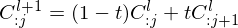
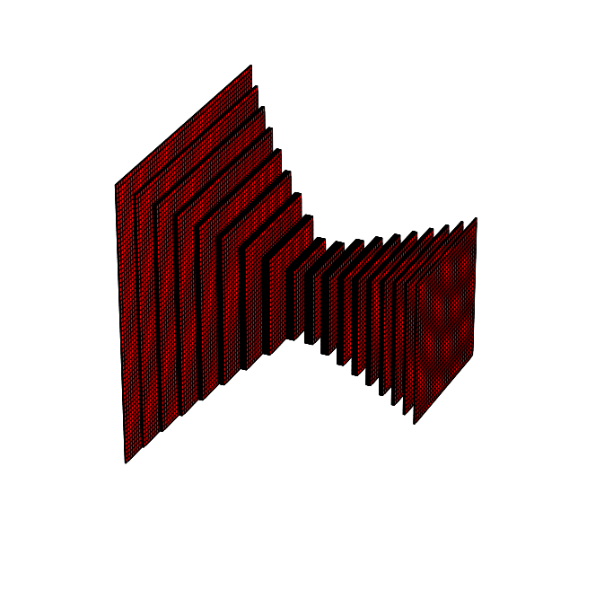
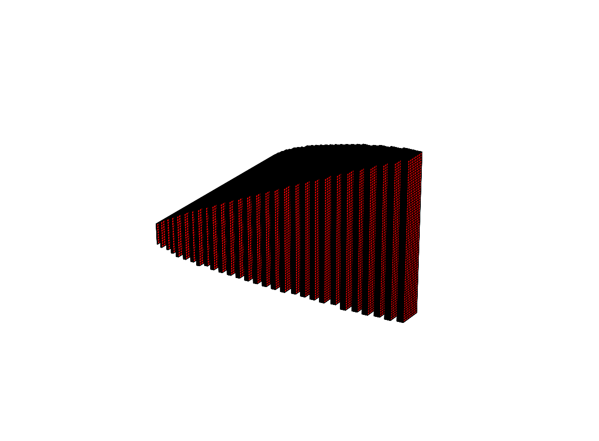

# Bezier Artificial Neural Networks

### Bezier Curves

#### Construction
Users are asked to construct a collection of control points. From these elements, we can resolve the bezier curve in a itterative convolution until we've exausted the column space of all but one element.




```python
import numpy as np
from Bezier import bezierCurve
from controlPoints import controlPointsUniformRandomEnclosingPrism

shape_in, shape_out = np.array([10, 32]), np.array([100, 2])
control_points = controlPointsUniformRandomEnclosingPrism(shape_in, shape_out)
bezier_curve = bezierCurve(shape_in, shape_out, control_points(10))
```

The code above demonstrates by example how to use the code in Bezier.py and controlPoints.py. 

Firstly, as we'll do for almost every example in this construction, we will specify the input shape of our samples and the desired output shape. We then can proceed in one of two possible directions. In the example above, we made use of the controlPoints.py module to construct an object which will develop a np.array of control points upon calling said object with the desired number of interior control points (see print statement below.). Otherwise, one can develop a custom set of control points which must be a np.array whose column space are the desired points and whose first column is the input shape and last column is the output shape.


```python
print(control_points(2))
```

    [[ 10.          47.69364088  99.94103248 100.        ]
     [ 32.           9.44529186  29.85408702   2.        ]]


We then instantiate a bezierCurve object that will evaluate the curve over the interval 0 to 1. Do note that for our purposes, the curve is discretized so as to conform with the conditions of constructing the layers of a Convolutional or Dense Artificial Neural Network. 

How can we sample the bezier curve so there's a high probability of sampling from regions of large curvature.


```python
import matplotlib.pyplot as plt
evl = np.stack([bezier_curve(t).flatten() for t in np.linspace(0, 1, 100)], axis = 0)
plt.scatter(evl[:,0], evl[:,1])
```


    <matplotlib.collections.PathCollection at 0x11bf52470>


### Bezier Networks

Dense and 2D-Convolutional constructions. Code Demonstration.

#### Autoencoder Architecture



to construct an Autoencoder Architecture, we'll have to construct two kwargs, one for the encoding ANN and one for the decoding ANN. 
    
```python 
shape_in, latent_space_shape, shape_out = np.array([10,32,32]), np.array([100,1,1]), np.array([10,16,16])

control1 = controlPointsUniformRandomEnclosingPrism(shape_in, latent_space_shape)(2)
control2 = np.flip(control1, axis = 1)

eC = {'shape_in': shape_in, 'shape_out': latent_space_shape, 'control_points': control1, 'bezier_samples': 10, 'layers': 1}
dC = {'shape_in': latent_space_shape, 'shape_out': shape_out, 'control_points': control2, 'bezier_samples': 10, 'layers': 1}

encoder = conv2dbezierNetwork(**eC)
decoder = conv2dbezierNetwork(**dC)
```

from this position, we can easily introduce these elements to a nn.Sequential().

#### Tetrahedral Architecture


To construct a Tetrahedral Architecture, we'll have to construct a single kwargs.

```python 
shape_in, shape_out = np.array([10,64,8]), np.array([10,8,64])
control1 = controlPointsUniformRandomEnclosingPrism(shape_in, shape_out)(2)
kwargs = {'shape_in': shape_in, 'shape_out': shape_out, 'control_points': control1, 'bezier_samples': 10, 'layers': 1}

tetra = conv2dbezierNetwork(**kwargs)
```

Both of these examples can be called with the appropriate sized tensor construct. My hope is to use these bezier networks to optimize over possible architectures which are modeled by position and number of control points of the bezier curve. 
